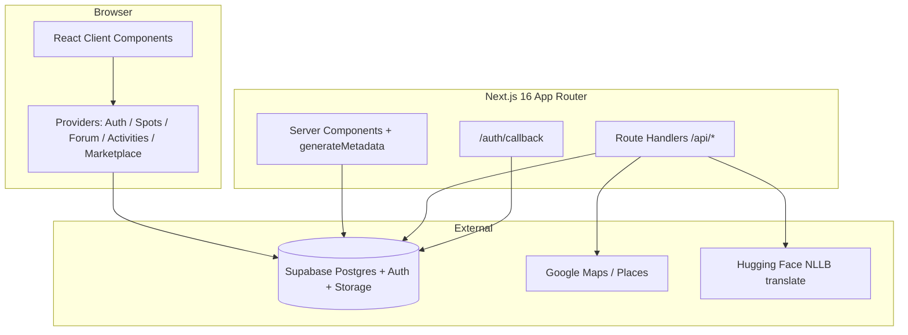

# Jompancing — Developer Cookbook

Malaysia fishing community: **spots**, **map**, **forum**, **activities**, **marketplace (COD)**, **guide**.  
Production: **https://jompancing.my** · Repo: **yflee95/jompancing** · Deploy: **Vercel** · DB/Auth: **Supabase**

---

## 中文速查（无脑开工）

```bash
# 1. 环境
cp .env.example .env.local   # 填 Supabase + SITE_URL
nvm use                      # .nvmrc → Node 22
npm install
npm run dev                  # http://localhost:3000/ms

# 2. 提交前
npm run typecheck
npm run lint
npm run build                # 需 Node >= 20

# 3. 运维脚本（要 SUPABASE_SERVICE_ROLE_KEY）
npm run seed:spots -- --dry-run
npm run enrich:spot-seo -- --dry-run

# 4. 生产：push master → Vercel 自动 deploy（勿 force push master）
```

| 我要… | 看下面章节 |
|--------|------------|
| 新电脑从零搭环境 | [First-time setup](#first-time-setup) |
| 加一个新页面 | [Recipe: New localized page](#recipe-new-localized-page) |
| 加 API | [Recipe: API route](#recipe-api-route) |
| 改钓点 / DB | [Recipe: Spots & Supabase](#recipe-spots--supabase) |
| SEO / sitemap | [SEO](#seo) |
| 部署 / env | [Deploy & environment](#deploy--environment) |
| 踩坑 | [Troubleshooting](#troubleshooting) |

---

## Table of contents

1. [Architecture](#architecture)
2. [First-time setup](#first-time-setup)
3. [Daily development](#daily-development)
4. [Project map](#project-map)
5. [Conventions](#conventions)
6. [Data & Supabase](#data--supabase)
7. [SEO](#seo)
8. [Recipes (cookbook)](#recipes-cookbook)
9. [Deploy & environment](#deploy--environment)
10. [Maintenance](#maintenance)
11. [Troubleshooting](#troubleshooting)
12. [Roadmap (not built yet)](#roadmap-not-built-yet)

---

## Architecture



**Locales:** `ms` (default), `en`, `zh` — always prefixed: `/ms/spots`, not `/spots` alone (middleware redirects).

**Content sources (production):**

| Feature | Source | Mock in prod? |
|---------|--------|----------------|
| Spots | Supabase `spots` | No (`loadPublicSpots` DB-only) |
| Forum | Supabase + optional dev mock | Mock off in prod |
| Activities | Supabase | Mock off in prod |
| Marketplace | Supabase | No |
| Guide | `src/data/mock-data.ts` articles | Static only (CMS TBD) |

**Mock flag:** `shouldUseMockContent()` — `true` in dev by default; **always false in production**. Override: `NEXT_PUBLIC_USE_MOCK_CONTENT=true` locally.

---

## First-time setup

### Requirements

- **Node.js ≥ 20** (recommended **22**, see `.nvmrc`)
- npm
- Supabase project
- Optional: Google Cloud (Maps, Places), Hugging Face token

### Steps

1. **Clone & install**

   ```bash
   git clone https://github.com/yflee95/jompancing.git
   cd jompancing
   nvm use
   npm install
   ```

2. **Environment**

   ```bash
   cp .env.example .env.local
   ```

   Minimum for local UI + auth:

   - `NEXT_PUBLIC_SUPABASE_URL`
   - `NEXT_PUBLIC_SUPABASE_ANON_KEY`
   - `NEXT_PUBLIC_SITE_URL=http://localhost:3000`

   For seed/enrich/admin delete:

   - `SUPABASE_SERVICE_ROLE_KEY`
   - `ADMIN_EMAILS=you@example.com`

3. **Supabase migrations** (SQL Editor, **in order**)

   | # | File |
   |---|------|
   | 1 | `supabase/migrations/001_initial.sql` |
   | 2 | `002_activities.sql` |
   | 3 | `003_google_profile.sql` |
   | 4 | `004_forum_comments.sql` |
   | 5 | `005_marketplace.sql` |
   | 6 | `006_curated_google_spots.sql` |
   | 7 | `007_ugc_translation.sql` |
   | 8 | `008_spots_updated_at.sql` |

4. **Supabase Auth** (see `.env.example` § Vercel deploy checklist)

   - Enable **Anonymous** sign-in (guest spot post)
   - **Google** OAuth optional
   - Redirect URLs: `http://localhost:3000/**`, production domains
   - Site URL: `https://jompancing.my/ms` (prod)

5. **Curated spots (optional)**

   ```bash
   # .env.local: GOOGLE_MAPS_API_KEY + service role
   npm run seed:spots -- --dry-run
   npm run seed:spots
   ```

6. **Run**

   ```bash
   npm run dev
   ```

   Open **http://localhost:3000/ms**

---

## Daily development

```bash
npm run dev          # hot reload
npm run typecheck    # fast gate
npm run lint         # ESLint, max-warnings 0
npm run build        # production build (prebuild checks Node)
```

**Before push:** `typecheck` + `lint`; `build` if you touched routing/SSR.

**Branch:** `master` → Vercel production. No force-push to `master`.

---

## Project map

```
jompancing/
├── messages/                 # next-intl: ms.json, en.json, zh.json (same keys!)
├── public/manifest.json      # PWA manifest (no service worker yet)
├── scripts/
│   ├── seed-google-spots.ts  # Google Places → Supabase spots
│   ├── enrich-spot-seo.ts    # Bulk SEO descriptions
│   └── check-node-version.mjs
├── supabase/migrations/      # Run manually in SQL Editor
└── src/
    ├── app/
    │   ├── [locale]/         # All user-facing pages
    │   ├── api/              # translate, geocode, address-search, admin
    │   ├── auth/callback/    # OAuth code exchange
    │   ├── sitemap.ts        # Dynamic sitemap
    │   ├── robots.ts
    │   ├── layout.tsx        # Passthrough root
    │   ├── icon.tsx / apple-icon.tsx / opengraph-image.tsx
    │   └── globals.css
    ├── components/
    │   ├── layout/           # Header, footer, nav, bottom nav
    │   ├── providers/        # Client data shells (Supabase + context)
    │   ├── seo/              # JSON-LD, breadcrumbs, home SEO hub
    │   ├── spots/ | forum/ | activities/ | marketplace/ | ...
    │   └── shared/           # Comments, share, filters, translate UI
    ├── data/
    │   ├── malaysia-states.ts
    │   ├── malaysia-areas.ts
    │   ├── mock-data.ts      # Guide articles + dev forum mocks
    │   └── spot-seo-enrichments.ts
    ├── i18n/
    │   ├── routing.ts        # locales, defaultLocale ms
    │   └── navigation.ts     # Link, redirect, useRouter (locale-aware)
    ├── lib/
    │   ├── seo.ts            # buildPageMetadata, canonical, hreflang
    │   ├── spots-seo.ts      # State browse + spot detail SEO helpers
    │   ├── content-seo.ts    # Forum/activity/marketplace/guide meta
    │   ├── supabase/         # client | server | public | service
    │   ├── mock-content.ts
    │   └── translate/
    └── types/index.ts        # Domain types + getLocalizedText()
```

### Important routes

| Path | Role |
|------|------|
| `/[locale]` | Home |
| `/[locale]/spots` | Browse; `?state=` redirects to `/spots/{stateSlug}` |
| `/[locale]/spots/[slug]` | **State landing** if `slug` matches state, else **spot detail** |
| `/[locale]/post` | Share new spot (noIndex) |
| `/[locale]/map` | Map explore |
| `/[locale]/search` | Global search (noIndex) |
| `/[locale]/login`, `/profile` | Auth (noIndex) |

State slugs are reserved — a spot slug must not collide with `johor`, `selangor`, etc. (see `malaysia-states.ts`).

---

## Conventions

### i18n

- **All user strings** in `messages/{ms,en,zh}.json` — keep keys identical across files.
- Server: `getTranslations({ locale, namespace: "spots" })` from `next-intl/server`.
- Client: `useTranslations("spots")`.
- **Links:** always `@/i18n/navigation` → `Link`, `useRouter`, `redirect` (not `next/link` directly).

### Localized DB fields

DB stores `title_ms`, `title_en`, `title_zh`. App uses `LocalizedString` + `getLocalizedText(value, locale)` with fallback chain **ms → en → zh**.

### Server vs client

- **Prefer Server Components** for data fetch + SEO.
- `"use client"` for forms, maps, providers, interactive UI.
- Supabase:
  - **Browser:** `createClient()` from `@/lib/supabase/client`
  - **Server (user session):** `createServerSupabaseClient()`
  - **Sitemap / public SSR:** `createPublicSupabaseClient()` (no cookies)
  - **Scripts / bypass RLS:** `createServiceSupabaseClient()` — **never in client bundle**

### Styling

- Tailwind v4, CSS variables in `globals.css` (`--ocean`, `--sand`, `--ink`, …).
- Display font: `font-serif-display`; UI: default sans.

### Metadata template

Root layout: `title.template = "%s | Jompancing"`.  
Use `titleAbsolute: true` in `buildPageMetadata` when the title already includes the brand (homepage).

---

## Data & Supabase

### Core tables (conceptual)

- `profiles` — extends auth.users
- `spots`, `spot_photos` — UGC + curated Google seeds
- `forum_posts`, `thread_comments` — forum + shared comments (spots use `thread_type`)
- `activities`
- `marketplace_listings` + storage bucket for photos
- Translation columns / cache — see `007_ugc_translation.sql`

### Spots routing logic

`src/app/[locale]/spots/[slug]/page.tsx`:

1. If `getStateBySlug(slug)` → render `SpotsRegionShell` (state filter UI).
2. Else fetch spot by slug from DB → `SpotDetailView` or private/not found.

### Admin

- `ADMIN_EMAILS` (comma-separated) → logged-in admin sees **Delete invalid spot** on curated spots.
- API: `src/app/api/admin/spots/[id]/route.ts` (service role server-side).

### Storage

Spot/listing photos upload via Supabase Storage (see migrations for bucket policies). Use existing upload patterns in `post-spot-form` / marketplace forms.

---

## SEO

| Asset | Location |
|-------|----------|
| Per-page meta | `generateMetadata` + `buildPageMetadata()` |
| Spot long-tail | `buildSpotDetailSeo()` in `spots-seo.ts` |
| JSON-LD | `src/components/seo/*` |
| Sitemap | `src/app/sitemap.ts` + `lib/sitemap-data.ts` |
| robots | `src/app/robots.ts` — disallows login, post, search, edit, etc. |

**Ops scripts:**

```bash
npm run enrich:spot-seo -- --dry-run
npm run enrich:spot-seo
npm run enrich:spot-seo -- --slug=paradise-fishing-villa-zsFfQ7qE
```

Rules: `src/data/spot-seo-enrichments.ts` — extend regex + copy, then re-run script.

**GSC:** sitemap `https://jompancing.my/sitemap.xml`; request indexing for top `/ms/spots/*` after copy changes.

---

## Recipes (cookbook)

### Recipe: New localized page

1. Create `src/app/[locale]/my-feature/page.tsx`.

2. **Metadata:**

   ```tsx
   import { getTranslations, setRequestLocale } from "next-intl/server";
   import { buildPageMetadata } from "@/lib/seo";
   import type { Locale } from "@/i18n/routing";

   export async function generateMetadata({
     params,
   }: {
     params: Promise<{ locale: Locale }>;
   }) {
     const { locale } = await params;
     const t = await getTranslations({ locale, namespace: "myFeature" });
     return buildPageMetadata({
       locale,
       path: "/my-feature",
       title: t("title"),
       description: t("subtitle"),
     });
   }

   export default async function MyFeaturePage({
     params,
   }: {
     params: Promise<{ locale: Locale }>;
   }) {
     const { locale } = await params;
     setRequestLocale(locale);
     const t = await getTranslations("myFeature");
     return <h1>{t("title")}</h1>;
   }
   ```

3. Add keys to **`messages/ms.json`**, **`en.json`**, **`zh.json`** under `"myFeature": { ... }`.

4. If public & indexable: add path to `PUBLIC_STATIC_PATHS` in `lib/sitemap-data.ts`.

5. If private (forms, auth): add `layout.tsx` with `noIndex: true` (copy from `login/layout.tsx`).

6. Link from nav only if product-ready: `site-header`, `bottom-nav`, or `mobile-more-sheet.tsx`.

---

### Recipe: API route

1. Create `src/app/api/my-endpoint/route.ts`.

2. Rate-limit pattern (copy from `api/translate/route.ts`):

   ```tsx
   import { rateLimit, rateLimitResponse } from "@/lib/rate-limit";

   export async function POST(request: Request) {
     const ip = request.headers.get("x-forwarded-for")?.split(",")[0]?.trim() ?? "unknown";
     const limited = rateLimit(`my-endpoint:${ip}`, 30, 60_000);
     if (!limited.ok) return rateLimitResponse(limited.retryAfterSec);
     // ...
   }
   ```

3. Never expose `SUPABASE_SERVICE_ROLE_KEY` to client routes without auth checks.

---

### Recipe: Spots & Supabase

**Read spots on server:**

```tsx
import { loadPublicSpots } from "@/lib/public-spots";
const spots = await loadPublicSpots();
```

**New column:**

1. New file `supabase/migrations/009_....sql`
2. Update `mapSpotRow` in `lib/supabase/spots.ts`
3. Update `FishingSpot` in `types/index.ts`
4. Run SQL on Supabase; redeploy

**SEO copy for many spots:** edit `spot-seo-enrichments.ts` → `npm run enrich:spot-seo`.

**Seed new areas:** `npm run seed:spots -- --state=selangor --district=petaling --dry-run`

---

### Recipe: Add guide article (current static CMS)

1. Edit `src/data/mock-data.ts` → `mockArticles` array (LocalizedString title/excerpt/body).
2. Add category key under `messages/*/guide.categories`.
3. Sitemap picks it up via `getGuideSlugs()` automatically.

*(Future: move articles to Supabase or MDX.)*

---

### Recipe: Add forum category label

1. Extend `ForumCategory` in `types/index.ts` if new enum value.
2. Add `forum.categories.myKey` in all three message files.
3. Update chips/filter UI if needed.

---

### Recipe: Windows — run enrich when `nvm use` fails

User path with spaces breaks `nvm use`. Call Node explicitly:

```powershell
& "$env:LOCALAPPDATA\nvm\v22.22.1\node.exe" .\node_modules\tsx\dist\cli.mjs scripts/enrich-spot-seo.ts --dry-run
```

---

### Recipe: Production deploy

1. Merge to `master` (or push commit).
2. Vercel builds with Node 20+ (`engines`, `vercel.json`).
3. Confirm env vars on Vercel match `.env.example`.
4. Smoke test: `/ms`, `/ms/spots`, one spot URL, login.
5. Optional: GSC URL inspection on changed URLs.

---

## Deploy & environment

Full variable list and Supabase auth checklist: **`.env.example`**.

| Variable | Where | Notes |
|----------|-------|-------|
| `NEXT_PUBLIC_SUPABASE_*` | Client + server | Required |
| `SUPABASE_SERVICE_ROLE_KEY` | Server/scripts only | Seed, enrich, admin API |
| `NEXT_PUBLIC_SITE_URL` | SEO, auth redirects | Must match deployed domain |
| `GOOGLE_MAPS_API_KEY` / `NEXT_PUBLIC_*` | Map + APIs | OSM fallback if unset |
| `HUGGINGFACE_API_TOKEN` | `/api/translate` | Optional; MyMemory fallback |
| `ADMIN_EMAILS` | Admin UI | Comma-separated |
| `GOOGLE_SITE_VERIFICATION` | Layout meta | Optional if GSC already verified |
| `NEXT_PUBLIC_USE_MOCK_CONTENT` | Dev only | Never true in prod |

**Do not commit:** `.env.local`, `seed-spots.log` (gitignored).

---

## Maintenance

### After each production deploy

- [ ] Spot check `/ms` and `/ms/spots`
- [ ] Vercel env still set
- [ ] If DB migration added: run SQL on Supabase **before** relying on new columns

### Monthly

- [ ] `npm run enrich:spot-seo -- --dry-run`
- [ ] GSC Performance / Indexing
- [ ] `npm outdated` → upgrade Next/eslint on a branch

### Dependency upgrades

```bash
git checkout -b chore/deps
npm update next eslint-config-next
npm run typecheck && npm run lint && npm run build
```

---

## Troubleshooting

| Symptom | Likely cause | Fix |
|---------|--------------|-----|
| `next build` / `??=` syntax error | Node 14 | `nvm use 22`, `node -v` |
| `tsx` fails on Windows | Old Node or nvm path | Direct `node.exe` path (see recipe) |
| Empty spots on site | Supabase env missing / RLS | Check `.env.local`, public spots in DB |
| Login redirect loop | Wrong Site URL / redirects | Supabase Auth URL config |
| OAuth error | Callback URL mismatch | Add `/auth/callback` + Supabase Google redirect |
| Sitemap missing spots | DB empty or fetch error | `loadPublicSpots`, run seed |
| Translate 401 persist | Not logged in | Ephemeral translate still works for guests |
| Map blank | No Google key | Set `NEXT_PUBLIC_GOOGLE_MAPS_API_KEY` or use Leaflet fallback |
| Mock forum in prod | Should not happen | `shouldUseMockContent()` false in prod |
| Title shows `\| Jompancing` twice | Long title + template | `titleAbsolute: true` on homepage meta |

---

## Roadmap (not built yet)

- Guide CMS (replace `mockArticles`)
- Paid activity promotion (Billplz / iPay88) — UI at `/activities/promote`
- Service worker / offline PWA
- Single canonical host (www vs apex) in Vercel + GSC
- In-app moderation queue (report is mailto-style today)

---

## License

Private repository — all rights reserved by project owner.

---

**Questions or onboarding:** read this file top-to-bottom once, then use [Recipes](#recipes-cookbook) as copy-paste starting points.
